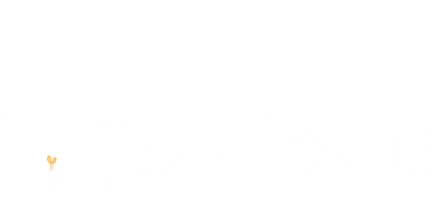

<!--
  README untuk tampilan profil organisasi GitHub IjenDev.id
  Taruh file ini di: .github/profile/README.md
-->

  <picture>
    <source media="(prefers-color-scheme: dark)" srcset="ijendevlogo.png">
    
  </picture>

<h1 align="center">Ijen Developer Indonesia (ijendev.id)</h1>

  Software House • IoT • Digitalization • Multimedia Support
   
  <a href="https://ijendev.id">Website</a> •
  <a href="mailto:contact@ijendev.id">Email</a> •
  <a href="https://www.linkedin.com/company/ijendev-id">LinkedIn</a> •
  <a href="https://instagram.com/ijendev.id">Instagram</a>

---

## 🚀 Tentang Kami
**Ijen Developer Indonesia (ijendev.id)** adalah software house Teknologi Informasi yang fokus pada pengembangan **website**, **desktop**, dan **mobile**. Berdiri sejak 2025, kami hadir sebagai mitra solusi digital bagi instansi pemerintah, perusahaan, rumah sakit, sekolah, hingga perorangan di seluruh Indonesia.

Selain pengembangan aplikasi, kami menyediakan layanan **Digital Marketing**, **IoT Solutions Architect**, dan **Multimedia Live Stream Event Support**. Kami percaya pada kolaborasi, transparansi, dan kualitas produk yang berkelanjutan.

---

## 🧩 Layanan Utama
| Layanan | Deskripsi Singkat | Teknologi/Stack |
|---|---|---|
| **Web & Backend** | Aplikasi kustom, dashboard, admin panel, integrasi API | Laravel, Node.js, PHP, MySQL/MariaDB, REST |
| **Mobile Apps** | Aplikasi Android/iOS satu kode basis | Flutter, Firebase |
| **IoT & Automasi** | Sensor & aktuator, telemetri, dashboard realtime | ESP32, RS485, MQTT/HTTP, Firebase/Cloud |
| **Digital Marketing** | Landing page, SEO/SEM, branding aset | Next.js/Landing, Analytics, Copywriting |
| **Live Streaming Support** | Event coverage, multi-platform simulcast | OBS, RTMP, Multi-cam workflow |

> Punya kebutuhan khusus? **Open to custom solution & long-term maintenance.**

---

## 🧱 Nilai & Prinsip Kerja
- **Impact-Driven** — solusi nyata untuk operasional dan keputusan bisnis.
- **Secure by Design** — autentikasi, otorisasi, & proteksi data sejak awal.
- **Docs & Transparency** — dokumentasi jelas, progress terukur, issue tracking.
- **Maintainable** — arsitektur modular, testable, dan siap scale.

---

## 🛠️ Tech Stack & Tools

  
  
  
  
  
  
  
  

---

## 📦 Proyek Unggulan
- 🌱 **SmartFarm Sitanam** — IoT pertanian presisi (irigasi, NPK, dashboard mobile).
- ⚡ **Gardu/PLN System** — manajemen data gardu & monitoring konsumsi BBM genset.
- 🥗 **GrowNutri** — transparansi gizi & SDGs (web + mobile + admin panel).

> Lihat tab **Pinned** untuk repositori pilihan.

---

## 🤝 Kolaborasi & Alur Kerja
1. **Discovery** → kebutuhan & scope (dokumen ringkas)
2. **Design & Arsitektur** → UX flow + arsitektur modul
3. **Sprint Development** → issue board, PR, QA
4. **UAT & Release** → staging → produksi + dokumentasi
5. **Maintenance** → SLA, monitoring, backlog perbaikan/fitur

**Standar Kode Singkat**
- Conventional Commits (`feat:`, `fix:`, `docs:`).
- Branching: `main` (stabil), `dev` (integrasi), `feature/*`.
- PR wajib **review** + checklist **lint/test** lulus.

---

## 📜 Aturan & Kebijakan (Do & Don’t)
> Berlaku untuk request klien, kontribusi publik, dan penggunaan repositori.

### ✅ Diperbolehkan (Do)
- Permintaan fitur yang **legal**, **etis**, dan **bermanfaat**.
- Penggunaan data **anonim/pseudonim** untuk pengujian.
- Membuka issue/bug report dengan detail: langkah reproduksi, log, screenshot.
- Kontribusi kode sesuai **coding style** & **license** repo terkait.

### ⛔ Dilarang (Don’t)
- **Konten ilegal**: cracking, carding, phising, malware, botnet, spam.
- **Pelanggaran privasi**: scraping data personal tanpa izin, doxxing, pelacakan tersembunyi.
- **SARA/ujaran kebencian**, pornografi, judi, atau konten berbahaya.
- **Manipulasi tidak etis**: deepfake merugikan, faking evidence, black-hat growth.
- **Pelanggaran lisensi**: plagiarisme aset/kode tanpa atribusi.
- Meminta **backdoor** atau akses ilegal ke sistem pihak lain.
- **Politik praktis** partisan menggunakan infrastruktur kami.

> Pelanggaran berat dapat berujung **penolakan layanan**, **pemblokiran akses**, dan bila perlu **pelaporan** ke otoritas terkait.

---

## 🔐 Privasi & Keamanan
- Data klien diproses **sesuai perjanjian** & **prinsip minimal akses**.
- Kredensial disimpan via **secrets manager** (bukan di repo).
- Audit trail melalui **Issues/PR/Release** & notulen sprint.

---

## 📫 Kontak
- **Email**: admin@ijendev.id  
- **Website**: https://ijendev.id  
- **Partnership**: jadwalkan diskusi awal (gratis) via email.

> “Building smart solutions for agriculture, energy, and governance — from Banyuwangi to Indonesia.”

---

  
ℹ️ Catatan Implementasi

- Simpan logo `ijendevlogo.png` di repo `.github` atau gunakan URL publik.
- Sesuaikan tautan sosial media & proyek unggulan.
- Pin repositori utama via **Customize organization profile ➝ Pinned**.
- Tambahkan badge CI/CD jika repo utama memakai GitHub Actions.

